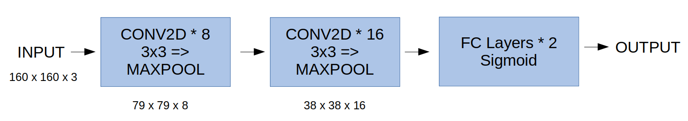

### Comparison of CNN and Pre Trained Model.
It is well known that deep learning is data hungry and requires a lot of training data to generalise well. In this project, we will compare 2 types of deep learning models and see which one performs better when training size is very small.

## Data
The data consists of MRI scans of the brain. The task is to identify whether the MRI has brain tumour or not. It is a classification problem which is solved using deep learning. The images can be downloaded from [here](https://www.kaggle.com/navoneel/brain-mri-images-for-brain-tumor-detection). We have a total of only 260 images of which 155 images have brain tumor, named as 'YES', and 105 images do not have brain tumor which are named as 'NO'. 

## Splitting the data
The data was spilt into Training and Validation Set. The training set has 220 images and validation set has 40 images. The ratio of 'YES' and 'NO' images is almost equal in both the sets (1.472 in training and 1.5 in validation).

## Training the Models
1. CNN Model
It is a sequential model having 2 Convolutional layers and 2 Fully Connected Layers.

